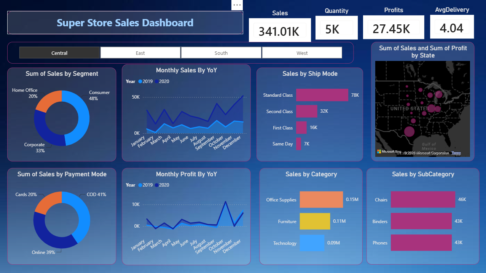
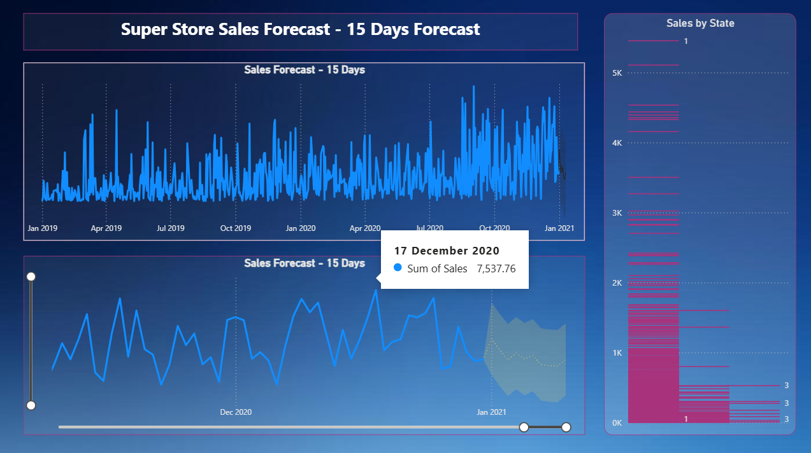

# HorizonTechX_Sales_Dashboard
Interactive Sales Dashboard built using Microsoft Power BI to analyze sales performance and business trends.

# 📊 HorizonTechX – Sales Dashboard using Power BI

## Project Overview

This project presents an interactive Sales Dashboard developed using Microsoft Power BI to analyze sales performance and support data-driven business decisions. The dashboard transforms raw sales data into meaningful visualizations, enabling users to monitor key performance indicators, identify trends, and evaluate business performance effectively.

## Objectives

- Analyze overall sales performance.
- Monitor revenue and profit trends.
- Compare sales across different regions and product categories.
- Develop sales forecasts using time series analysis.
- Present insights through an interactive and user-friendly dashboard.

## Tools & Technologies

- Microsoft Power BI
- CSV Dataset
- Time Series Forecasting
- Data Visualization

## Dashboard Features

- Interactive Sales Dashboard
- KPI Cards
- Sales Trend Analysis
- Region-wise Performance
- Category-wise Analysis
- Monthly Sales Trends
- Interactive Filters (Slicers)
- Time Series Sales Forecasting
- Business Performance Visualization

## Learning Outcomes

- Applied data analysis techniques to transform raw sales data into meaningful business insights.
- Utilized time series analysis to generate sales forecasts.
- Designed an interactive Power BI dashboard for effective data visualization.
- Strengthened skills in business intelligence, dashboard design, and data-driven decision-making.

## Business Value

The dashboard enables stakeholders to:

- Monitor sales performance efficiently.
- Identify high-performing regions and product categories.
- Track revenue trends over time.
- Support strategic business decisions using visual analytics and forecasting.

## Author

**Alisha Khan**

BCA Student | Aspiring Data Analyst | Data Science & AI Enthusiast

